# Architecture Overview

Understanding the system design and data flow of Agent-Loop.

## System Overview

Agent-Loop is a production-ready autonomous AI agent system that automates task execution using Claude Agent SDK with MiniMax API backend.

## High-Level Architecture

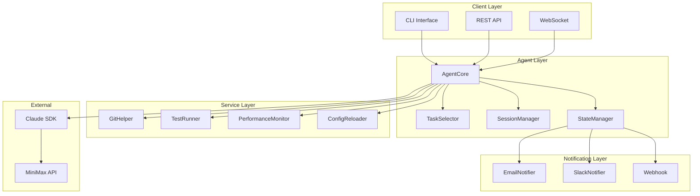

## Core Components

### AgentCore (`agent/agent_core.py`)

The central orchestrator that coordinates all components.

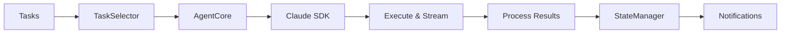

### Session Manager (`agent/session_manager.py`)

Manages agent sessions, context, and history.

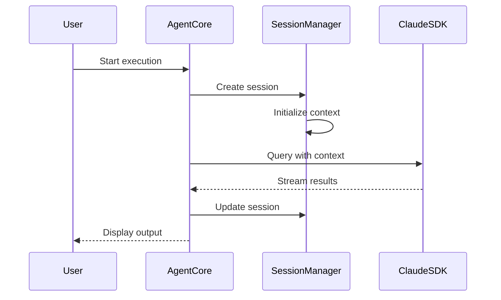

### State Manager (`agent/state_manager.py`)

Handles persistent state and configuration.

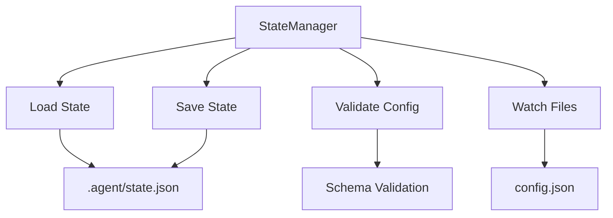

### Notification System

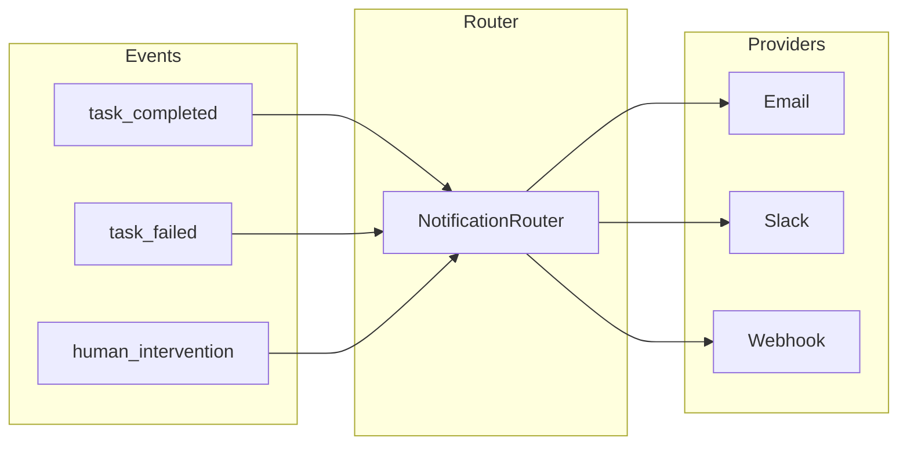

## Data Flow

### Task Execution Flow

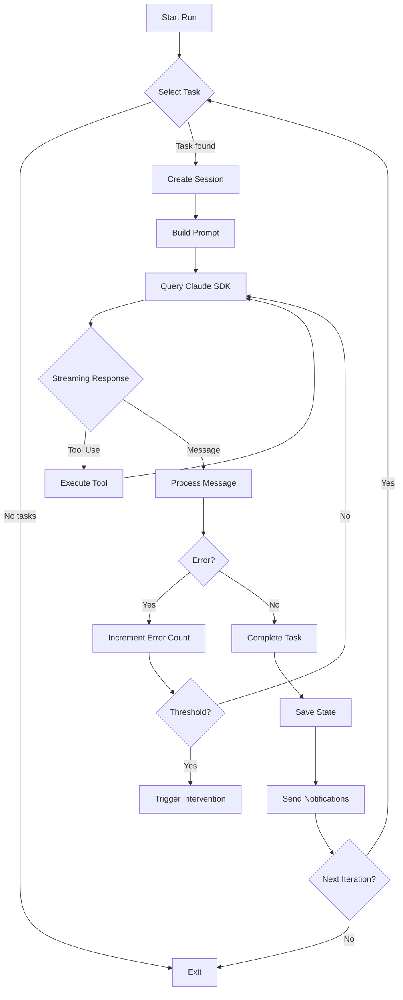

### Configuration Reload Flow

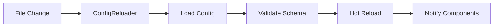

## Module Dependencies

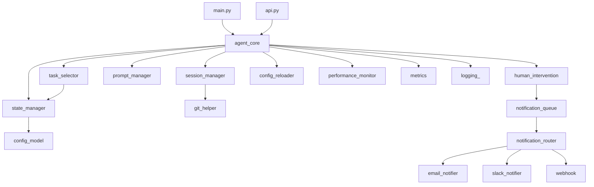

## File Structure

```
agent/
├── __init__.py           # Package initialization
├── agent_core.py         # Core agent orchestration
├── config_model.py       # Pydantic config models
├── config_reloader.py    # Hot config reload
├── console.py            # CLI output formatting
├── constants.py          # Constants and enums
├── email_notifier.py     # Email notifications
├── exceptions.py        # Custom exceptions
├── git_helper.py         # Git operations
├── human_intervention.py # Intervention logic
├── logging_.py          # Structured logging
├── metrics.py            # Prometheus metrics
├── model_provider.py     # API provider abstraction
├── notification_queue.py # Async notification queue
├── notification_router.py# Event routing
├── performance_monitor.py# Performance tracking
├── prompt_manager.py    # Prompt templates
├── session_manager.py   # Session lifecycle
├── slack_notifier.py    # Slack notifications
├── state_manager.py     # State persistence
├── task_selector.py     # Task selection logic
├── test_runner.py       # Test execution
└── webhook.py           # Webhook notifications
```

## API Server Architecture

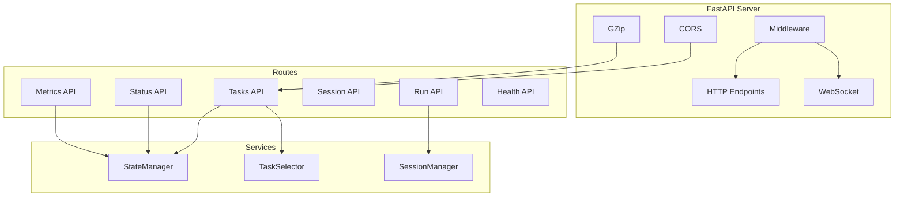

## Deployment Architecture

### Development Mode

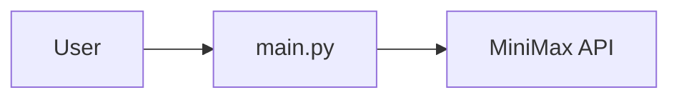

### Production Mode (Docker)

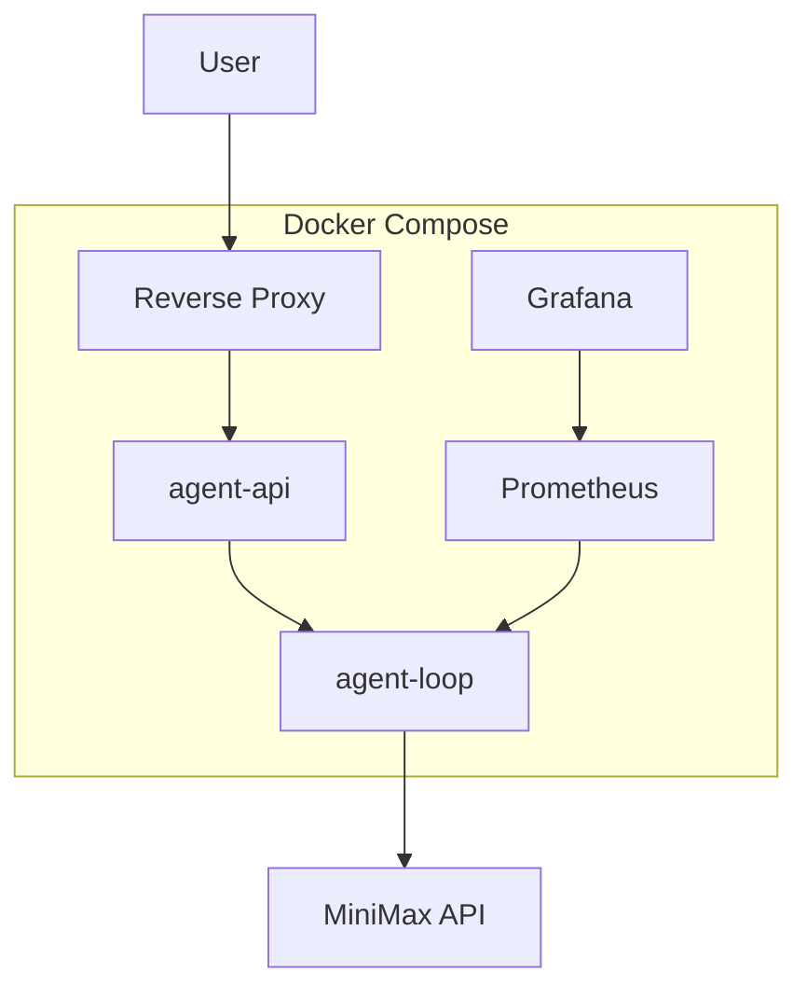
